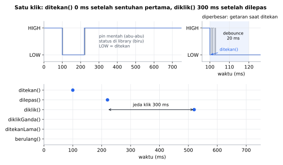
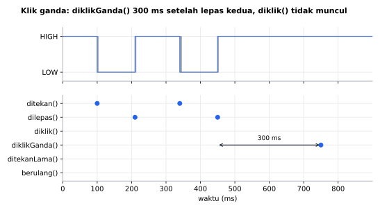
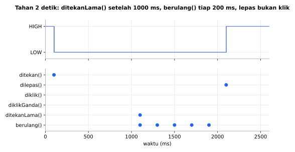

# TombolPintar

[English](README.en.md)

Library Arduino berbahasa Indonesia untuk **tombol**: debounce, klik, klik ganda, klik N kali, tekan lama, dan tekan lama berulang. Semuanya non-blocking dan hanya memakai **16 byte RAM per tombol**.

```cpp
if (tombol.diklik())      ...
if (tombol.diklikGanda()) ...
if (tombol.ditekanLama()) ...
```

## Fitur

- **Debounce aktif sejak awal** dan langsung bereaksi pada sentuhan pertama, tanpa jeda.
- **Klik, klik ganda, klik N kali** (`jumlahKlik()`), dan **tekan lama**.
- **Tekan lama berulang** seperti tombol volume: tahan untuk menaikkan angka terus-menerus.
- **`ditekan()` untuk aksi instan** tanpa menunggu jeda klik ganda (tombol game, bel, tombol darurat).
- **Hemat RAM**: 16 byte per tombol, jadi 10 tombol di Arduino Uno hanya memakai 160 byte.
- **`pinMode()` di `mulai()`**, bukan di constructor, sehingga aman di ESP32, Nano ESP32, dan STM32.
- **Sumber apa saja**: pull-up/pull-down internal, modul sentuh TTP223, tombol analog (LCD Keypad Shield), pin sentuh ESP32, IO expander, dan shift register lewat `perbarui(bool)`.
- **"Tahan saat menyalakan"**: tombol yang sudah ditekan saat `mulai()` terbaca di `sedangDitekan()` tanpa memicu event palsu.
- Aman saat `millis()` meluap (setelah ±49 hari menyala).

## Board yang didukung

| Board | Teruji compile |
|---|---|
| Arduino Uno / Nano | ✅ |
| Arduino Mega | ✅ |
| ESP32 DevKit | ✅ |
| ESP32-C3 / S3 | ✅ |
| STM32 Blackpill F411 | ✅ |
| STM32 Bluepill F103 | ✅ |

STM32 memakai core resmi **STM32duino** (STMicroelectronics). Library ini hanya memakai `digitalRead()` dan `millis()`, jadi seharusnya bekerja di board Arduino lain juga.

## Instalasi

**Library Manager:** Arduino IDE → *Sketch → Include Library → Manage Libraries…* → cari **TombolPintar** → *Install*.

**Manual:** unduh ZIP dari GitHub → *Sketch → Include Library → Add .ZIP Library…*

## Sambungan

Cara paling mudah: satu kaki tombol ke pin, kaki lainnya ke **GND**. Tidak perlu resistor.

| Rangkaian | Mode |
|---|---|
| Tombol ke GND, tanpa resistor | `PULLUP_INTERNAL` (default) |
| Tombol ke VCC, tanpa resistor (ESP32 & STM32 saja) | `PULLDOWN_INTERNAL` |
| Tombol ke GND + resistor pull-up eksternal | `AKTIF_LOW` |
| Tombol ke VCC + resistor pull-down eksternal | `AKTIF_HIGH` |
| Modul sentuh TTP223 | `AKTIF_HIGH` |

```cpp
TombolPintar tombol(2);                              // pull-up internal
TombolPintar sentuh(3, TombolPintar::AKTIF_HIGH);    // TTP223
```

## Contoh cepat

```cpp
#include <TombolPintar.h>

TombolPintar tombol(2);

void setup() {
  Serial.begin(115200);
  tombol.mulai();
}

void loop() {
  tombol.perbarui();

  if (tombol.diklik()) Serial.println("Klik");
  if (tombol.diklikGanda()) Serial.println("Klik ganda");
  if (tombol.ditekanLama()) Serial.println("Tekan lama");
}
```

Panggil `perbarui()` di setiap `loop()` sebelum memeriksa event. Hindari `delay()` panjang di `loop()`, karena tombol hanya dibaca saat `perbarui()` dipanggil.

## Hasil simulasi



Kontak tombol tiruan bergetar beberapa milidetik setiap ditekan dan dilepas. `ditekan()` muncul tepat di sentuhan pertama, getaran berikutnya diabaikan, dan `diklik()` baru muncul 300 ms setelah dilepas karena library menunggu kemungkinan klik kedua.



Dua klik beruntun dilaporkan sekali sebagai `diklikGanda()`, tanpa `diklik()` tambahan dan tanpa klik palsu dari getaran kontak.



Saat ditahan, `ditekanLama()` muncul sekali di 1 detik, `berulang()` terus berdetak tiap 200 ms, dan melepas tombol setelahnya tidak dihitung sebagai klik.

Semua grafik adalah **simulasi**: tombol dan getaran kontaknya tiruan, `loop()` memanggil `perbarui()` tiap 0,1 ms, dan pengaturan memakai nilai default. Bukan pengukuran hardware.

Grafik dibuat dari simulasi di PC yang menjalankan kode library ini (`extras/simulasi`):
```sh
cd extras/simulasi
python gambar.py   # butuh g++ dan matplotlib
```

## Kecepatan & memori

Diukur dengan simavr (simulator ATmega328P yang akurat per siklus) di Arduino Uno 16 MHz, sketch yang sama untuk semua library: klik, klik ganda, dan tekan lama aktif (sejauh library mendukung), satu tombol di pin 2. Angka = siklus per panggilan fungsi update library (`perbarui()`, `tick()`, `loop()`, `read()`, ...), termasuk `digitalRead()` (±73 siklus).

| Library | RAM per objek | Diam | Ditahan | Jeda klik | Tekan lama berulang | Flash sketch |
|---|---|---|---|---|---|---|
| **TombolPintar 1.0.0** | **16 B** | 197 (12 µs) | 203 (13 µs) | 208 (13 µs) | 800 (50 µs) | 5.292 B |
| OneButton 2.6.2 | 83 B | 266 (17 µs) | 269 | 281 | 319 | 6.046 B |
| Button2 2.7.0 | 59 B | 175 (11 µs) | 232 | 170 | 167 | 5.606 B |
| EasyButton 2.0.3 | 113 B | 328 (21 µs) | 393 | 328 | 426 | 5.896 B |
| AceButton 1.10.1 | 17 B + config bersama | 233 (15 µs) | 271 | 252 | 255 | 5.712 B |
| JC_Button 2.1.6 | 24 B | 175 (11 µs) | 201 | 175 | 201 | 5.174 B |
| Bounce2 2.71 | 19 B | 174 (11 µs) | 174 | 174 | 174 | 5.004 B |
| ezButton 1.0.6 | 26 B | 184 (12 µs) | 173 | 184 | 173 | 5.000 B |

`perbarui()` O(1) waktu dan memori. Lewat `perbarui(bool)` (tanpa `digitalRead()`) jalur diam hanya 126 siklus.

Jujur soal kekalahan:
- JC_Button, Bounce2, dan ezButton ±20 siklus (±1,5 µs) lebih cepat dan sedikit lebih kecil di flash, karena tidak menghitung klik ganda atau tekan lama berulang.
- Selama tombol ditahan melewati batas tekan lama, `perbarui()` memakai satu pembagian 32 bit (±600 siklus) untuk menghitung `berulang()`. Menghindarinya butuh RAM tambahan per tombol, sedangkan jalur ini hanya aktif saat tombol ditahan >1 detik, jadi sengaja dibiarkan. 50 µs per `loop()` tetap jauh di bawah waktu debounce.

Mengulang pengukuran: sketch `extras/benchmark/TombolPintarBenchmark` (butuh simavr). Versi pesaing di atas diunduh dari rilis resminya.

## `ditekan()` atau `diklik()`?

Tombol yang bisa diklik dua kali harus menunggu sebentar (jeda klik, default 300 ms) untuk memastikan klik kedua tidak datang. Karena itu:

| Fungsi | Kapan true | Pakai untuk |
|---|---|---|
| `ditekan()` | **Langsung** saat tombol disentuh | Aksi yang harus cepat: tombol game, bel, tombol darurat |
| `diklik()` | 300 ms setelah dilepas, jika tidak ada klik kedua | Tombol dengan beberapa fungsi (klik / klik ganda / tekan lama) |

Tidak butuh klik ganda? Panggil `aturJedaKlik(0)`, maka `diklik()` langsung true saat tombol dilepas.

## Sumber selain pin digital

Baca sendiri sumbernya, lalu kirim hasilnya ke `perbarui(bool)`. `true` artinya tombol sedang ditekan.

```cpp
TombolPintar kanan, atas;   // tanpa pin

void loop() {
  int a = analogRead(A0);   // LCD Keypad Shield
  kanan.perbarui(a < 60);
  atas.perbarui(a >= 60 && a < 200);
  ...
}
```

Cara yang sama berlaku untuk pin sentuh ESP32 (`touchRead()`), IO expander (PCF8574, MCP23017), shift register (74HC165), atau tombol yang dikirim lewat jaringan.

## Referensi fungsi

### Dasar

| Fungsi | Keterangan |
|---|---|
| `TombolPintar(uint8_t pin, Mode mode = PULLUP_INTERNAL)` | Tombol di pin digital. |
| `TombolPintar()` | Tanpa pin, untuk dipakai dengan `perbarui(bool)`. |
| `bool mulai()` | Panggil di `setup()`. `false` jika `PULLDOWN_INTERNAL` dipakai di board yang tidak mendukung (AVR). |
| `bool perbarui()` | Panggil di setiap `loop()`. `true` jika ada event baru. |
| `bool perbarui(bool ditekan)` | Sama, untuk sumber selain pin digital. |

### Event

Event hanya `true` selama satu `perbarui()`, lalu otomatis hilang.

| Fungsi | Keterangan |
|---|---|
| `bool ditekan()` | Tombol baru saja ditekan (instan). |
| `bool dilepas()` | Tombol baru saja dilepas. |
| `bool diklik()` | Satu klik selesai. |
| `bool diklikGanda()` | Dua klik selesai. |
| `uint8_t jumlahKlik()` | Jumlah klik beruntun yang baru selesai (1, 2, 3, …). `0` jika belum ada. |
| `bool ditekanLama()` | Tombol sudah ditahan selama batas tekan lama. Sekali per tekanan. |
| `bool berulang()` | `true` saat mencapai batas tekan lama, lalu berulang setiap interval selama tombol tetap ditahan. |

Klik yang diikuti tekan lama dibatalkan, dan melepas tombol setelah tekan lama tidak dihitung sebagai klik.

### Status

| Fungsi | Keterangan |
|---|---|
| `bool sedangDitekan()` | `true` selama tombol ditekan. |
| `uint32_t durasiTekan()` | Lama tombol sudah ditekan (ms), `0` jika tidak ditekan. |

### Pengaturan

| Fungsi | Default | Keterangan |
|---|---|---|
| `aturDebounce(uint8_t ms)` | 20 | Getaran kontak selama waktu ini diabaikan. Naikkan untuk saklar tua atau limit switch. |
| `aturJedaKlik(uint16_t ms)` | 300 | Batas waktu antar-klik untuk klik ganda. `0` = tanpa klik ganda, klik langsung dilaporkan. |
| `aturTekanLama(uint16_t ms)` | 1000 | Lama tombol ditahan hingga dianggap tekan lama. |
| `aturUlang(uint16_t ms)` | 200 | Interval `berulang()`. `0` = tidak berulang. |

## Contoh yang tersedia

*File → Examples → TombolPintar*

| Contoh | Isi |
|---|---|
| `DasarKlik` | Klik, klik ganda, dan tekan lama. |
| `TekanInstan` | Perbedaan `ditekan()` dan `diklik()`. |
| `KlikBanyak` | Satu tombol untuk banyak perintah lewat `jumlahKlik()`. |
| `TahanBerulang` | Naik/turunkan angka dengan dua tombol, tahan untuk cepat. |
| `BanyakTombol` | Beberapa tombol dalam array. |
| `SentuhTTP223` | Modul sentuh TTP223. |
| `KeypadShieldLCD` | Lima tombol LCD Keypad Shield di satu pin A0. |
| `SentuhESP32` | Pin sentuh bawaan ESP32 / ESP32-S3. |

## Dibanding library lain

Diukur di Arduino Uno dengan sketch yang sama (klik, klik ganda, tekan lama):

| Library | Klik ganda & tekan lama | RAM per tombol |
|---|---|---|
| **TombolPintar** | ✅ | **16 B** |
| OneButton | ✅ | 83 B |
| Button2 | ✅ | 59 B |
| EasyButton | ✅ | 113 B |
| JC_Button | tanpa klik ganda | 24 B |
| Bounce2 | hanya debounce | 20 B |
| ezButton | hanya tekan/lepas | 26 B |

## Cara kerja debounce

Saat kontak tombol bergetar, sinyalnya naik-turun beberapa milidetik. TombolPintar langsung menerima perubahan **pertama**, lalu mengabaikan getaran selama waktu debounce (20 ms). Hasilnya reaksi tanpa jeda dan tanpa klik ganda palsu.

Konsekuensinya, gangguan listrik singkat di kabel yang sangat panjang bisa terbaca sebagai tekanan. Untuk kabel panjang, pakai resistor pull-up eksternal 4,7–10 kΩ dan kapasitor 100 nF dari pin ke GND.

## Pengujian

Logika klik, klik ganda, tekan lama, berulang, dan luapan `millis()` diuji otomatis di PC (`extras/test`) setiap ada perubahan:

```sh
cd extras/test
g++ -std=c++11 -I. -I../../src uji.cpp ../../src/TombolPintar.cpp -o uji && ./uji
```

## Status

Versi 1.0.0 sudah lolos uji logika otomatis dan compile di 7 board, tapi **belum diuji di hardware sungguhan**. Jika menemukan masalah, silakan buka *issue* di GitHub.

## Lisensi

MIT © 2026 Amadeo Wisesa. Lihat [LICENSE](LICENSE).
